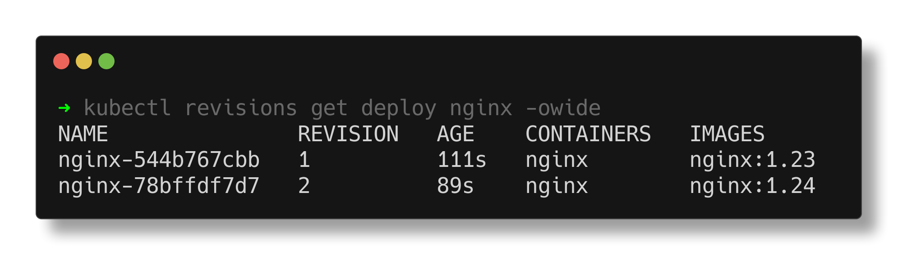
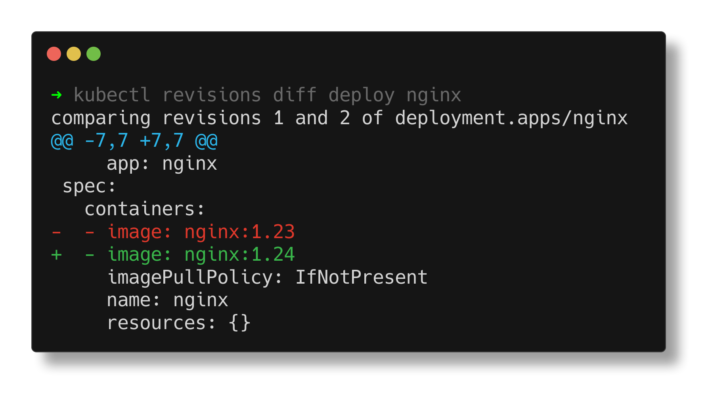
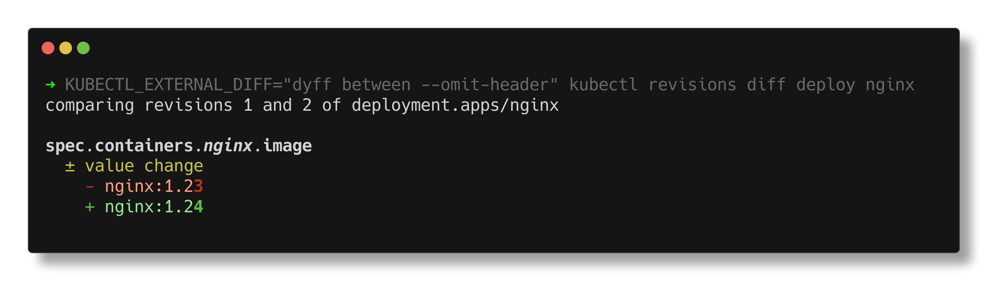

# kubectl-revisions

🚀 *Time-travel through your workload revision history* 🕰️

## About

`kubectl-revisions` is a [kubectl plugin](https://kubernetes.io/docs/tasks/extend-kubectl/kubectl-plugins/) and can be invoked as `kubectl revisions`, or for short `k revisions`.

The `revisions` plugin allows you to go back in time in the history of revisions and answers common questions like "Why was my Deployment rolled?"

It gives more output than `kubectl rollout history` and is easier to use than `kubectl get replicaset` or `kubectl get controllerrevision`.

## Installation

Using [krew](https://krew.sigs.k8s.io/) (recommended):

```bash
kubectl krew install revisions
```

Using go:

```bash
go install github.com/timebertt/kubectl-revisions@latest
```

Learn how to set up shell completion:

```bash
kubectl revisions completion -h
```

## Usage

### `k revisions get` / `k revisions list`

Get the revision history of a workload resource (`Deployment`, `StatefulSet`, or `DaemonSet`).


<!-- generated with:
termshot --show-cmd -f docs/assets/get.png -- kubectl revisions get deploy nginx -owide
-->

The history is based on the `ReplicaSets`/`ControllerRevisions` still in the system. I.e., the history is limited by the
configured `revisionHistoryLimit`.

By default, all revisions are printed as a list. If the `--revision` flag is given, the selected revision is printed
instead.
This is similar to using `k get replicaset` or `k get controllerrevision`, but allows easy selection of the relevant objects and returns a sorted list.
This is also similar to `k rollout history`, but doesn't only print revision numbers.

### `k revisions diff` / `k revisions why`

Compare multiple revisions of a workload resource (`Deployment`, `StatefulSet`, or `DaemonSet`).
A.k.a., "Why was my Deployment rolled?"


<!-- generated with:
termshot --show-cmd -f docs/assets/diff.png --edit -- kubectl revisions diff deploy nginx
-->

The history is based on the `ReplicaSets`/`ControllerRevisions` still in the system. I.e., the history is limited by the
configured `revisionHistoryLimit`.

By default, the latest two revisions are compared. The `--revision` flag allows selecting the revisions to compare.

The `k revisions diff` command uses `diff -u -N` to compare revisions by default.
It also respects the `KUBECTL_EXTERNAL_DIFF` environment variable like the `kubectl diff` command.
To get a nicer diff output, you can use one of these:

```bash
# Use a colored external diff program
export KUBECTL_EXTERNAL_DIFF="colordiff -u"
# Use dyff as a rich diff program
export KUBECTL_EXTERNAL_DIFF="dyff between --omit-header"
# Show diff in VS Code
export KUBECTL_EXTERNAL_DIFF="code --diff --wait"
```

For example:


<!-- generated with:
termshot --show-cmd -f docs/assets/diff-dyff.png -- KUBECTL_EXTERNAL_DIFF='"dyff between --omit-header"' kubectl revisions diff deploy nginx
-->
